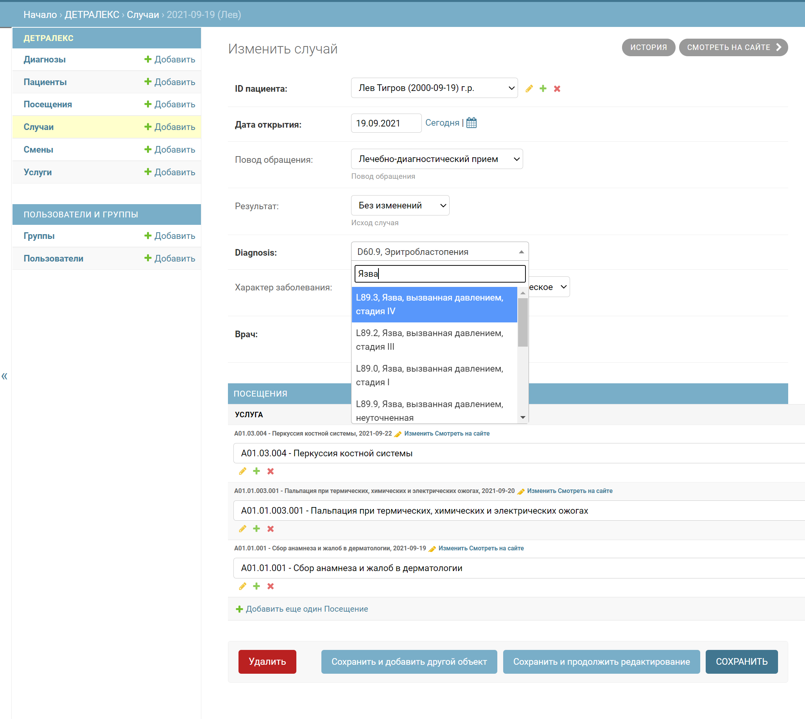
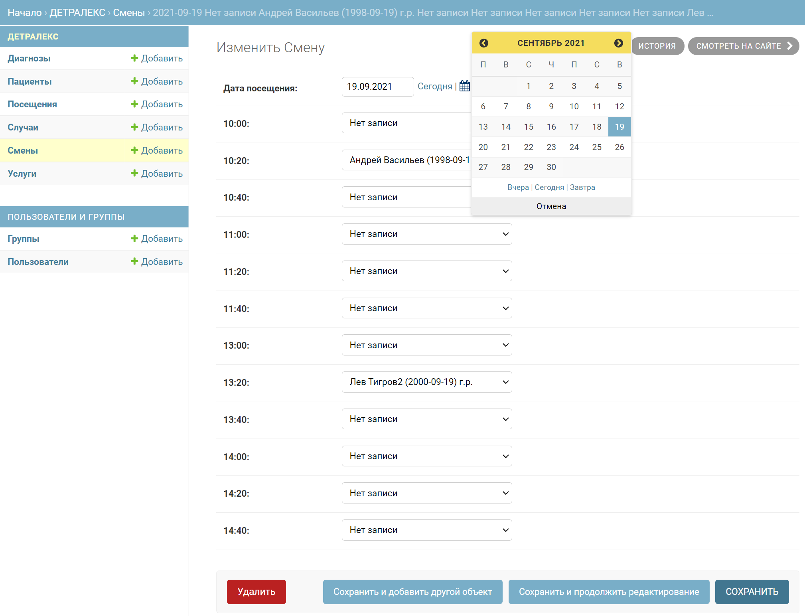

# Прототип медицинской информационной системы для поликлиники

 ### Для запуска необходимо:
 1. Python версии не ниже 3.8
 2. Установленный фреймворк django и django-autocomlete
 3. Запустить сервер можно локально из командной строки командой py -3 manage.py runserver
 4. Перейти по адресу http://127.0.0.1:8000/admin и войти(логин и пароль выдаётся администратором, то есть мной)
 

# Реализация в панели администратора
### Главная страница

### Вкладка "Пациенты"
Поддерживается поиск по ФИО, фильтры. Строки с пациентами кликабельны

### Данные конкретного пациента
Данные сгруппированы, поля максимально формализованны(для каждого поля подгружена последняя версия справочника nsi.rosminzdrav) Внизу есть список случаев, заведенных на этого пациента(тоже кликабельные)

### Вкладка "Случай"
Для поля "Диагноз" подключен классификатор МКБ-10, поиск нужного кода осуществляется по первым буквам названия болезни

### Смена
Для управления расписанием есть вкладка "Смена". Выбрать дату можно при помощи ручного ввода либо виджета "календарик". На поле каждого временного интервала выпадает список пациентов.

